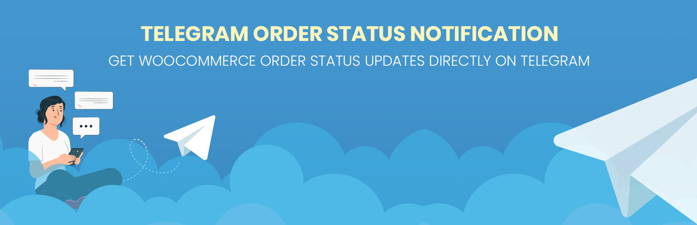
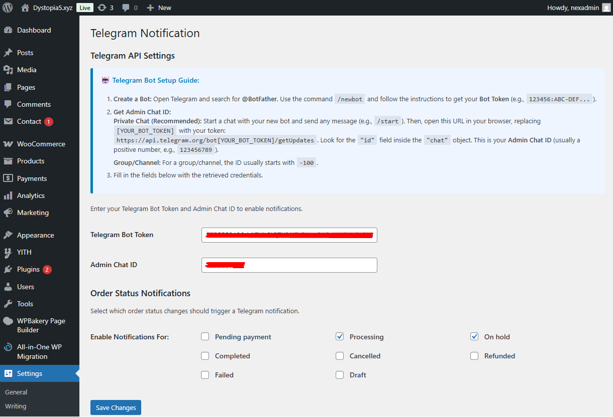
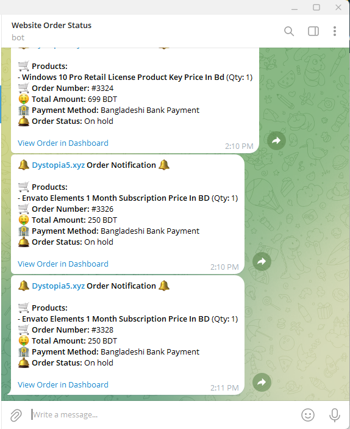

# 🔔 Telegram Order Status Notification for WooCommerce

This plugin provides instant order notifications for WooCommerce directly to your Telegram chat. Configure your Telegram Bot Token and Chat ID, select the order statuses you wish to track, and receive timely alerts every time an order status changes on your site.
---

## 📌 Plugin Information
- **Contributors:** shagor447  
- **Tags:** woocommerce, telegram, notification, order, admin
- **Requires at least:** WordPress 6.0
- **Tested up to:** WordPress 6.9  
- **Requires PHP:** 7.4  
- **Stable tag:** 1.0.2 
- **License:** [GPLv3 or later](https://www.gnu.org/licenses/gpl-3.0.html)

---

## 📖 Description
Telegram Order Status Notification for WooCommerce is a lightweight WooCommerce plugin that instantly sends order status change notifications to an admin’s Telegram chat. It helps store owners monitor orders in real time without logging into the WordPress dashboard repeatedly. Whenever an order status changes (Pending, Processing, On-hold, Completed, etc.), a clean and clear notification is sent directly to Telegram via a bot.
---

## ✨ Features
- Instant Telegram Notifications: Receive real-time Telegram alerts whenever a WooCommerce order status changes.
- Selectable Order Statuses: Choose exactly which order statuses should trigger notifications (Pending, Processing, On-hold, Completed, etc.)
- Easy Telegram Bot Integration: Simple setup using Telegram Bot Token and Chat ID — no complex configuration required.
- Customizable Message Format: Order notifications include clean order details such as order ID, products, total amount, and status.
- Admin-Friendly Monitoring: Perfect for store owners who want instant updates without checking the admin panel frequently.
- Secure & Lightweight: No customer data is stored. Uses WordPress and WooCommerce best practices.
- Plugin Check Compliant: Fixed duplicate notifications, escaping issues, and HTML/currency symbol problems.

---

## ⚙️ Installation
- Upload the `telegram-order-status-notification` folder to the `/wp-content/plugins/` directory.
- Activate the plugin through the 'Plugins' menu in WordPress.
- Go to Settings -> Telegram Notification.
- Enter your Telegram Bot Token and Chat ID.
- Select the order statuses you want to track and save changes, You will now receive Telegram notifications instantly when order statuses change.

---

## ❓ Frequently Asked Questions

### 🔹 Do I need a Telegram Bot?
Yes. You need to create a Telegram Bot and use its Bot Token.

### 🔹 Can I choose which order statuses to receive notifications for?
Yes. You can enable notifications only for selected statuses.

### 🔹 Does it send duplicate notifications?
No. Duplicate notification issues have been fully fixed.

### 🔹 Is it compatible with other WooCommerce plugins?
Yes. It works alongside all standard WooCommerce payment gateways and plugins.

---

## 🖼️ Screenshots
1. Plugin settings page, order status selection options. 
2. Telegram notification example (admin view). 

---

## 📝 Changelog

### 1.0.2
- Fixed critical error on the settings page.
- Prevented duplicate Telegram notifications.
- Removed HTML and currency symbols from order totals.
- Fixed product name display issues.
- Resolved multiple security and escaping issues.

### 1.0.0
- Initial release.

---

## 📢 Update Notice
= 1.0.2 = Stable release. Fixes critical timing issues, duplicate notifications, and improves overall security and compliance.

## ⚖️ License & Copyright
- Copyright © **Raisul Islam Shagor** 
- Email: deploy@raisul.dev
- Website: https://raisul.dev/
- Conatct: https://raisul.dev/contact
- Licensed under the **GPLv3 or later**  
- ✅ This plugin is **free to use, modify, and distribute** under the license terms.
