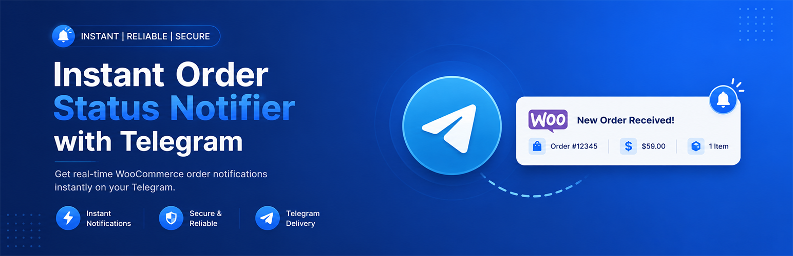
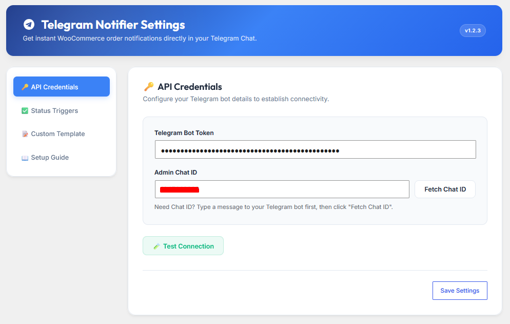
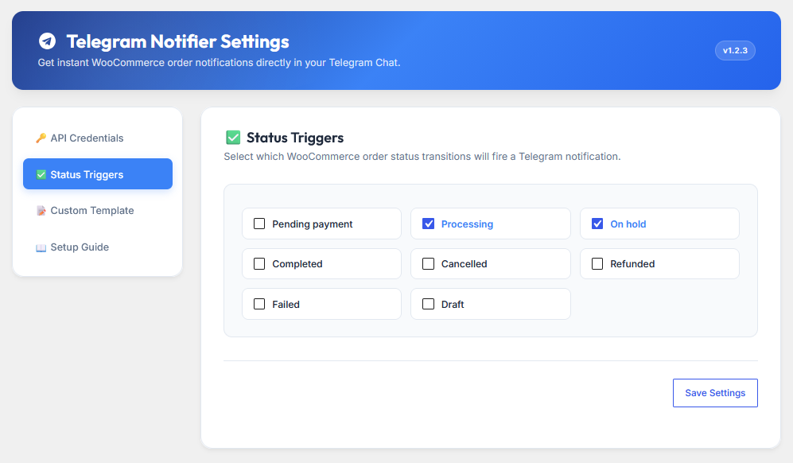
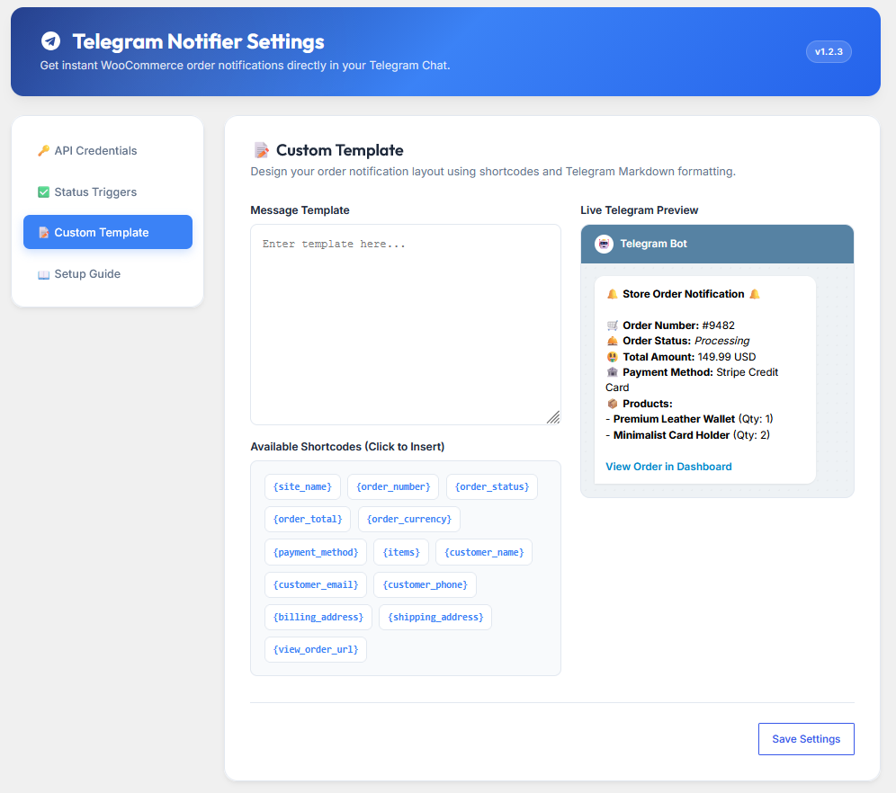
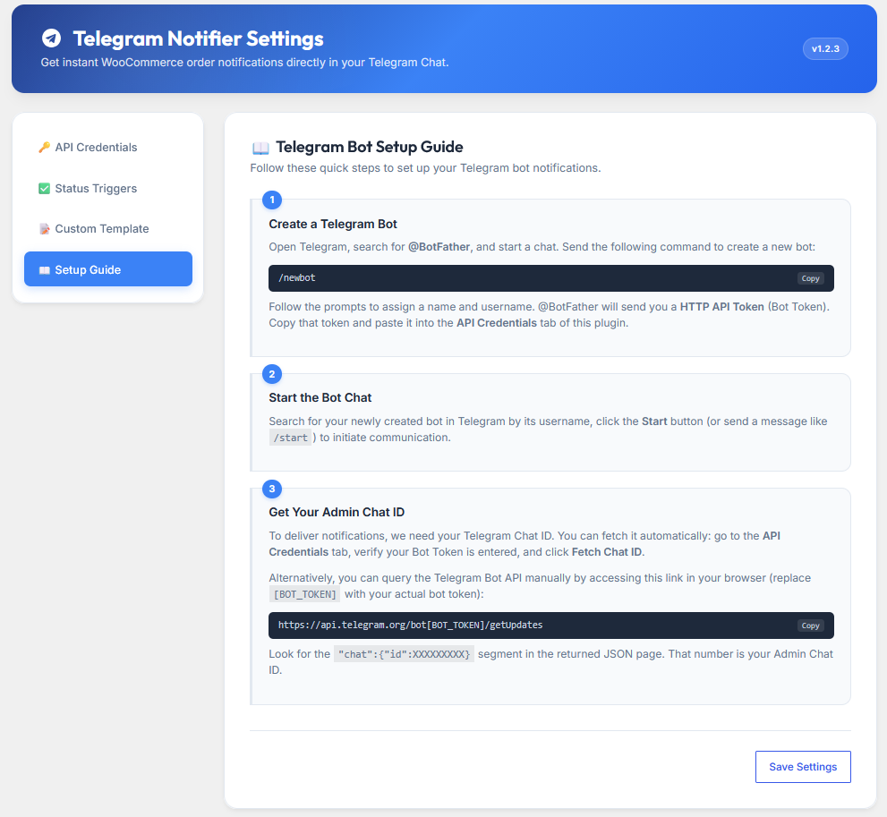
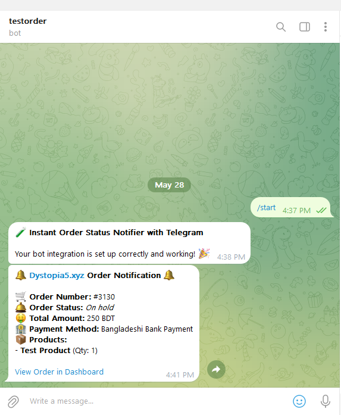

# 🔔 Telegram Order Status Notification for WooCommerce

This plugin provides instant order notifications for WooCommerce directly to your Telegram chat. Configure your Telegram Bot Token and Chat ID, select the order statuses you wish to track, and receive timely alerts every time an order status changes on your site.
---

## 📌 Plugin Information
- **Contributors:** shagor447  
- **Tags:** woocommerce, telegram, notification, order, admin
- **Requires at least:** WordPress 6.0
- **Tested up to:** WordPress 7.0 
- **Requires PHP:** 7.4  
- **Stable tag:** 1.2.3 
- **License:** [GPLv3 or later](https://www.gnu.org/licenses/gpl-3.0.html)

---

## 📖 Description
Telegram Order Status Notification for WooCommerce is a lightweight WooCommerce plugin that instantly sends order status change notifications to an admin’s Telegram chat. It helps store owners monitor orders in real time without logging into the WordPress dashboard repeatedly. Whenever an order status changes (Pending, Processing, On-hold, Completed, etc.), a clean and clear notification is sent directly to Telegram via a bot.
---

## ✨ Features
- Instant Telegram notifications for WooCommerce order status changes.
- Selectable order statuses (Pending, Processing, On-hold, Completed, etc.).
- Premium, modern responsive tabbed settings interface.
- Customizable notification message template builder with click-to-insert shortcodes.
- Live Telegram Preview mockup that renders Markdown live as you edit your template.
- Built-in connection tester to send mock messages to your bot.
- Automated Admin Chat ID lookup tool to easily fetch your ID.
- Interactive, step-by-step setup guide for Telegram Bot integration.

---

## ⚙️ Installation
- Upload the `telegram-order-status-notification` folder to the `/wp-content/plugins/` directory.
- Activate the plugin through the 'Plugins' menu in WordPress.
- Go to Settings -> Telegram Notification.
- Enter your Telegram Bot Token and Chat ID.
- Select the order statuses you want to track and save changes, You will now receive Telegram notifications instantly when order statuses change.

---

## ❓ Frequently Asked Questions

### 🔹 Do I need a Telegram Bot?
Yes. You need to create a Telegram Bot and use its Bot Token.

### 🔹 Can I choose which order statuses to receive notifications for?
Yes. You can enable notifications only for selected statuses.

### 🔹 Does it send duplicate notifications?
No. Duplicate notification issues have been fully fixed.

### 🔹 Is it compatible with other WooCommerce plugins?
Yes. It works alongside all standard WooCommerce payment gateways and plugins.

---

## 🖼️ Screenshots
1. Telegram API Credentials setup. 
2. Order status trigger setup. 
3. Custom telegram message template setup. 
4. Telegram setup guide. 
5. Telegram bot notification message. 

---
== External services ==

This plugin uses the Telegram Bot API to send notifications.
* Service: Telegram Bot API (https://api.telegram.org)
* Data: Sends WooCommerce order details (ID, Total, Status, Items) via HTTPS request.
* Policy: [Terms](https://telegram.org/tos), [Privacy](https://telegram.org/privacy)
---

## 📝 Changelog

### 1.2.3
- Enhancement: Redesigned Admin UI settings panel with a modern responsive tabbed design and premium layout styling.
- Enhancement: Added customizable message templates supporting custom text and Telegram Markdown formatting.
- Enhancement: Added click-to-insert shortcode badges for orders (status, items, total, site name, billing/shipping address, customer contacts).
- Enhancement: Added Live Telegram Preview mockup that renders Markdown live as you edit your template.
- Enhancement: Added "Fetch Chat ID" tool to automatically query the bot API and retrieve your Admin Chat ID.
- Enhancement: Added "Test Connection" tool to send a mock message to your Telegram bot.
- Compatibility: Fully tested and compatible with the latest versions of WordPress (7.0) and WooCommerce.

### 1.0.5
- Fix: Resolved 404 error by updating the 'Plugin URI' to a valid public URL.
- Fix: Converted inline CSS styles to the standard 'admin_enqueue_scripts' hook using wp_enqueue_style to comply with review guidelines.
- Fix: Added mandatory resource versioning to style registration to prevent browser caching issues and satisfy Plugin Check.

### 1.0.4
- Fix: Completely removed the restricted term "WooCommerce" from the plugin name and slug as per updated WordPress review guidelines.
- Fix: Updated text domain to "instant-order-status-notifier-with-telegram".
- Fix: Resolved trademark conflict by renaming the plugin and updating the slug.

### 1.0.3
- Fix: Resolved trademark conflict by renaming the plugin to "Instant Telegram Order Notifier for WooCommerce".
- Fix: Added mandatory 'sanitize_callback' to register_setting() to ensure secure data handling.
- Fix: Addressed all 'OutputNotEscaped' security errors in the admin settings page as reported by the Plugin Check tool.
- Enhancement: Added mandatory "External services" disclosure for Telegram Bot API usage.
- Enhancement: Improved Admin UI alignment for order status checkboxes.

### 1.0.2
- Fixed critical error on the settings page.
- Prevented duplicate Telegram notifications.
- Removed HTML and currency symbols from order totals.
- Fixed product name display issues.
- Resolved multiple security and escaping issues.

### 1.0.0
- Initial release.

---

## 📢 Update Notice
= 1.2.3 =
Introduced a redesigned premium Admin UI, custom message template builder with shortcode badges, connection testing tool, automated Chat ID lookup, and full compatibility validation for WordPress 7.0 and WooCommerce.

## ⚖️ License & Copyright
- Copyright © **Raisul Islam Shagor** 
- Email: deploy@raisul.dev
- Website: https://raisul.dev/
- Conatct: https://raisul.dev/contact
- Licensed under the **GPLv3 or later**  
- ✅ This plugin is **free to use, modify, and distribute** under the license terms.
